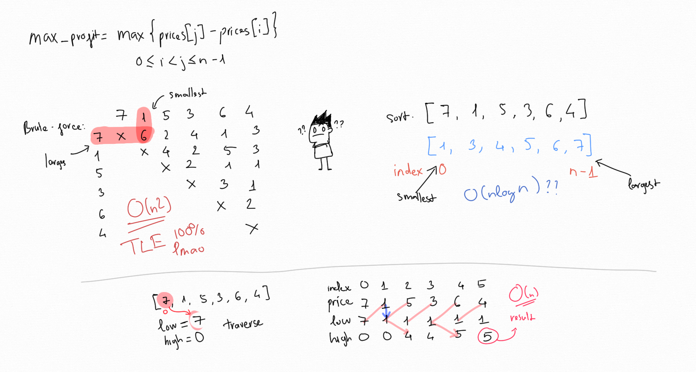

# Best Time to Buy and Sell Stock [Easy]

Problem: https://leetcode.com/problems/best-time-to-buy-and-sell-stock/

## 1. Idea

That was easy to think. I dont understand how and why people keep using dynamic
programming for this problem. Or maybe I just dont understand dp well, sadly...

So I try my best. that is traverse. Just go straight input array to find
smallest and largest number. The subtract of them is the result.



## 2. Example

```go
func maxProfit(prices []int) int {
	l, h := prices[0], 0
	for _, p := range prices {
		l = min(p, l)
		h = max(h, p-l)
	}
	return h
}

func max(a, b int) int {
	if a > b {
		return a
	}
	return b
}

func min(a, b int) int {
	if a < b {
		return a
	}
	return b
}
```

## 3. Submission Detail

```
210 / 210 test cases passed.
Status: Accepted
Runtime: 120 ms
Memory Usage: 8.7 MB
```
