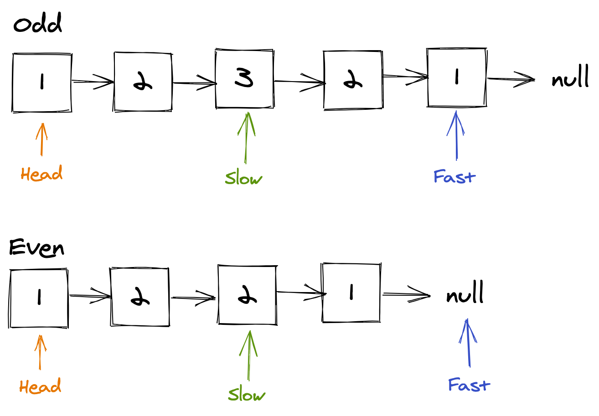

# Palindrome linked list [Easy]

Problem: https://leetcode.com/problems/palindrome-linked-list/

## 1. Idea

Use slow and fast method to quickly find a middle node. Slow is the node keep
going forward to next node, meanwhile fast is double in iteration, until fast's
node or next node is null (end of linked list). There is odd linked list and
even linked list so even node will take one more step to make slow go forward.

Now we have 2 part of linked list: the full one and the half one.



## 2. Step by Step

1. Linked list have 1 node: alway `true`
2. Make a stack to storage the values
3. Iteration fast and slow, store the slow value by apped to stack
4. Slow pointer keep going forward to compare to last stack item, if they
difference, break and the result is `false`
5. When no item left on stack, return `true`

## 3. Example

```go
/**
 * Definition for singly-linked list.
 * type ListNode struct {
 *     Val int
 *     Next *ListNode
 * }
 */

func isPalindrome(head *ListNode) bool {
	if head.Next == nil {
		return true
	}

	slow, fast := head, head
	stack := []int{}

	for fast != nil && fast.Next != nil {
		stack = append(stack, slow.Val)
		slow = slow.Next
		fast = fast.Next.Next
	}

	if fast != nil {
		slow = slow.Next
	}

	for slow != nil {
		if slow.Val != stack[len(stack)-1] {
			return false
		}
		slow = slow.Next
		stack = stack[:len(stack)-1]
	}

	return true
}

func (list *ListNode) print() {
	if list == nil {
		fmt.Print("NULL")
		return
	}
	fmt.Printf("%v -> ", list.Val)
	list.Next.print()
}
```

# 4. Submission detail

```
85 / 85 test cases passed.
Status: Accepted
Runtime: 168 ms
Memory Usage: 13.4 MB
```