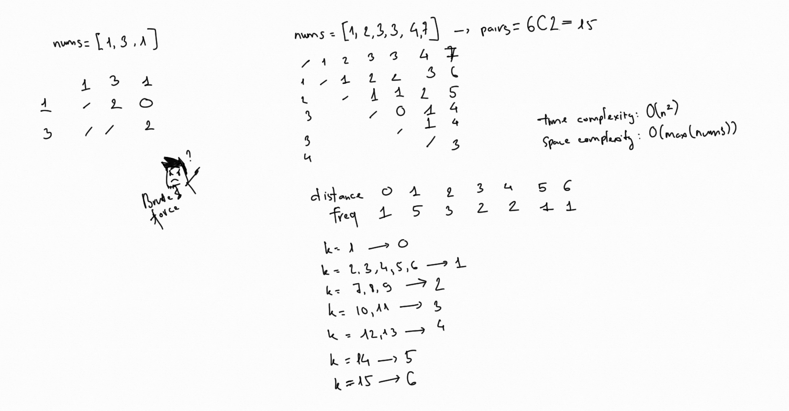

# Find K-th Smallest Pair Distance [Hard]

Problem: https://leetcode.com/problems/find-k-th-smallest-pair-distance/

## 1. Idea

Firstly, when I pick a pair to calc distance result will make `O(n^2)` time
complexity.



But I've reach TLE when use this way... That mean I need to find another way.


Imagine we can sort the array of distances of all pair. That will look like:
`[0, 1, 1, ..., x-1, x, x+1, x+1, ...]` where `x` is the `k`th smallest
distance. Should be the `x` if:

* That means at most `k-1` smaller than numbers ahead.
* (Count of smaller than `x`) + (Count of same as `x`) >= `k`

Example: Give a array of distance `[0, 1, 2, 2 ,2, 4, 5]`, `5`th smallest is
`2`. There are 3 numbers smaller, and 2 numbers same. 3 + 2 >= 5 (true)

From the meaning of question, result must exist in range [`low`, `high`]. We
could use binary search to count numbers of distance smaller or equal to `mid`.

## 2. Example

```go
func smallestDistancePair(nums []int, k int) int {
	n := len(nums)
	sort.Ints(nums)

	low := nums[1] - nums[0]
	for i := 2; i < n; i++ {
		low = min(low, nums[i]-nums[i-1])
	}

	high := nums[n-1] - nums[0]
	for low < high {
		mid := low + (high-low)/2
		if count(nums, mid) < k {
			low = mid + 1
		} else {
			high = mid
		}
	}

	return low
}

func count(nums []int, mid int) int {
	n := len(nums)
	res := 0
	i, j := 0, 1
	for j < n {
		if nums[j]-nums[i] <= mid {
			res += j - i
			j++
		} else {
			i++
		}
	}
	return res
}

func min(a, b int) int {
	if a < b {
		return a
	}
	return b
}
```

## 3. Submission Detail

```
19 / 19 test cases passed.
Status: Accepted
Runtime: 4 ms
Memory Usage: 3.5 MB
```
