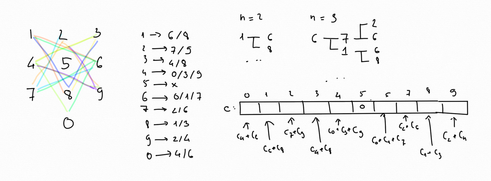

# Knight Dialer [Medium]

Problem: https://leetcode.com/problems/knight-dialer/

## Idea

Following problem, I think about recursive. But honestly I dont know how to do
with recursive, lol. So I just do simple way.

First, understanding how knight move. At position `(i, j)` without any blocking
around, knight can move to 8 difference positions: `(i-1, j-2)`, `(i-1, j+2)`,
`(i-1, j-1)`, `(i-1, j+1)`, `(i-2, j-2)`, `(i-2, j+2)`, `(i-2, j-1)`,
`(i-2, j+1)`.

Secondly, this look like a summary of all case. So we can do it quickly by a
loop. Initial the first case: `n = 1`. We have 10 way to make a distinct number.
So from `n = 2` to 5000 (problem constraints). We keep sum up the way we can
move the Knight.



## Example

```go
const m = 1_000_000_007

func knightDialer(n int) int {
	c := []int{1, 1, 1, 1, 1, 1, 1, 1, 1, 1}
	for i := 1; i < n; i++ {
		n := make([]int, 10)
		n[0] = (c[4] + c[6]) % m
		n[1] = (c[6] + c[8]) % m
		n[2] = (c[7] + c[9]) % m
		n[3] = (c[4] + c[8]) % m
		n[4] = (c[3] + c[9] + c[0]) % m
		n[5] = 0
		n[6] = (c[1] + c[7] + c[0]) % m
		n[7] = (c[2] + c[6]) % m
		n[8] = (c[1] + c[3]) % m
		n[9] = (c[2] + c[4]) % m
		c = n
	}
	s := 0
	for _, v := range c {
		s += v
	}
	return s % m
}
```

## Submission Detail

```
121 / 121 test cases passed.
Status: Accepted
Runtime: 12 ms
Memory Usage: 6.4 MB
```
