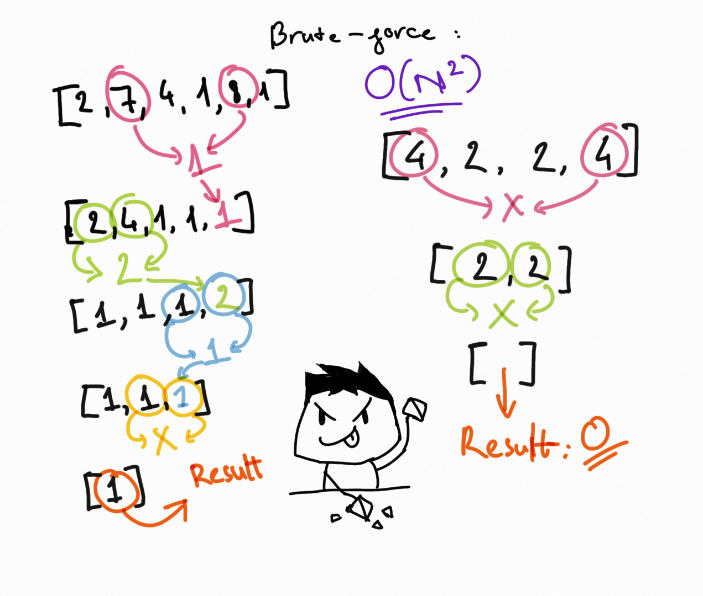
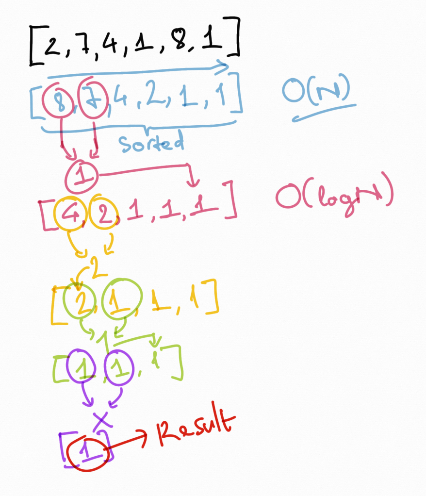

# Last Stone Weight [Easy]

Problem: https://leetcode.com/problems/last-stone-weight/

## 1. Idea

The easiest idea is brute force, found 2 largest stone and combine them
together, until we get one or nothing left. Return the result.



But traverse through array two times to find two biggest numbers make the
complexity of the problem is `N ^ 2`.

So we could try a better way is sorted, then take two numbers from head could
make complexity more easier



But this is algorithm, we need to think bigger...

In **C++** (or **Java**), we have `priority_queue`[^1], which based on `heap`
can quickly resolved this problem

[^1]: Reference: https://www.cplusplus.com/reference/queue/priority_queue/

> This context is similar to a heap, where elements can be inserted at any
> moment, and only the max heap element can be retrieved (the one at the top in
> the priority queue).

```cpp
int lastStoneWeight(vector<int>& stones) {
  priority_queue<int> heap(begin(stones), end(stones));
  while (heap.size() > 1) {
    int y = heap.top(); heap.pop();
    int x = heap.top(); heap.pop();
    if (y > x) heap.push(y - x);
  }
  return heap.empty() ? 0 : heap.top();
}
```

In **Go**, we have `container/heap` built in module, but we have to implement
priority queue. `heap.Init()` take pointer variable have type `x`, and `x` had
implement some requirement method: `Len`, `Less`, `Swap`, `Pop`, `Push`. So all
we need to do is make a type and write some function to implement that.

Wait... hold up boys. What is heap?

Heap just like a tree. But it more complete and stored in an array. Binary heap
is also divided into *maximum heap* and *minimum heap*. The maximum properties
are: each node is greater than or equal to its two children.

Now what is priority queue?

A key feature of priority queue is when you insert or delete some elements, the
elements are sorted automatically.

Quick tips: I do not imagine heap as a tree. I imagine it as a hierarchy.


## 2. Example

### 2.1. Brute Force way

**Code:**

```go
func MaxIntSlice(s []int) (int, int) {
	index := 0
	max := s[index]
	for i, v := range s {
		if v > max {
			index = i
			max = v
		}
	}
	return max, index
}

func lastStoneWeight(stones []int) int {
	for {
		if len(stones) == 0 {
			return 0
		}
		if len(stones) == 1 {
			return stones[0]
		}
		y, i := MaxIntSlice(stones)
		stones = append(stones[:i], stones[i+1:]...)
		x, j := MaxIntSlice(stones)
		stones = append(stones[:j], stones[j+1:]...)
		if y != x {
			stones = append(stones, y-x)
		}
	}
}
```

**Submission Detail:**

```
70 / 70 test cases passed.
Status: Accepted
Runtime: 0 ms
Memory Usage: 2 MB
```

### 2.2. Heap way

**Code:**

```go
type max_heap []int

func (h max_heap) Len() int            { return len(h) }
func (h max_heap) Less(i, j int) bool  { return h[i] > h[j] }
func (h max_heap) Swap(i, j int)       { h[i], h[j] = h[j], h[i] }
func (h *max_heap) Push(x interface{}) { *h = append(*h, x.(int)) }
func (h *max_heap) Pop() interface{} {
	n := len(*h)
	x := (*h)[n-1]
	*h = (*h)[:n-1]
	return x
}

func lastStoneWeight(stones []int) int {
	pq := max_heap(stones)
	heap.Init(&pq)
	for pq.Len() > 1 {
		heap.Push(&pq, heap.Pop(&pq).(int)-heap.Pop(&pq).(int))
	}
	return heap.Pop(&pq).(int)
}
```

**Submission Detail:**

```
70 / 70 test cases passed.
Status: Accepted
Runtime: 0 ms
Memory Usage: 2 MB
```
