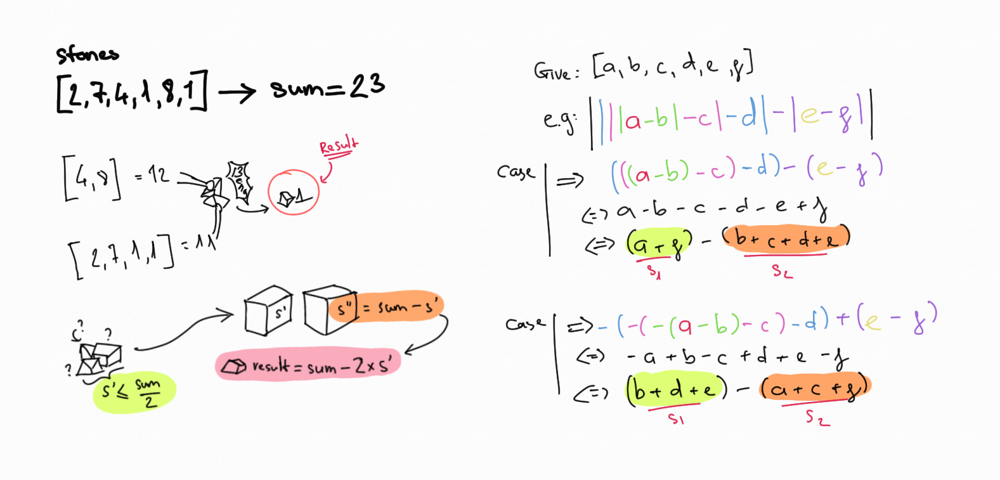

# Last Stone Weight II [Medium]

Problem: https://leetcode.com/problems/last-stone-weight-ii/

## 1. Idea

Firstly, I really stuck in this problem in more than half a day. Happy that I
still resolved this problem as a weak CS knowledge. Trying to understand what
dynamic programming is and how to use it make me go crazy.

Finally I maked it work, lol. So the problem is how to combine the stones?

I can see that whatever order you combine them isn't matter. Let take an
example:

Giving to you some stones: `[a, b, c, d, e, f]` and you going to smash them
ramdomly. I will take a combine like: `a` vs `b` to make `a'` (dont matter what
greater one lol), `a'` vs `c` to make `c'`, `c'` vs `d` to make `d'`, `e` vs
`f` to make `e'`, `d'` vs `e'` are the rest and we I got result.

The formula going like `||||a-b|-c|-d| - |e-f||`*(1)* right?

The absolute is weird, it could be explain `x` to `x` (if `x >= 0`) and `-x`
(if `x < 0`). So `|a - b|` can be right down as `a - b` or `-a + b`, but which
one is the correct?

Now the formula *(1)* can be write down as multiple way:

- `(((a-b)-c)-d)-(e-f)` *(a)*
- `-(-(-(a-b)-c)-d)+(e-f)` *(b)*
- etc...

Now remove brackets:

- *(a)* <=> `a-b-c-d-e+f`
- *(b)* <=> `-a+b-c+d+e-f`

What now? We can see that the formula now going to monomial, before each
character is a plus or minus sign. Let's group them together:

- *(a)* <=> `(a+f) - (b+c+d+e)`
- *(b)* <=> `(b+d+e) - (a+c+f)`



So it's easier to think of, any compensates each other for the combine rock will
eventually transform into one. This similar to **Target Sum** problem. We could
use dynamic programming to find every case that could be reach to target sum.
Finally the result is the smallest target sum that is greater than zero.

The important is not all "adding signs" strategies will have a corresponding
"cancellation of stones" operation. For example `+a+b+c+d+e+f` is meaning less.
But what we are looking for is the smallest target (which also a positive
number), which can prove that there must be a corresponding "cancellation of
stones" operation.

## 2. Example

```go
func lastStoneWeightII(stones []int) int {
	total_weight := 0
	for _, weight := range stones {
		total_weight += weight
	}
	half := total_weight / 2
	dp := make([]int, half+1)
	dp[0] = 1
	for _, stone := range stones {
		for x := half; x >= stone; x-- {
			dp[x] |= dp[x-stone]
		}
	}
	result := total_weight
	for x := 0; x <= half; x++ {
		result = min(result, total_weight-dp[x]*x*2)
	}
	return result
}

func min(a, b int) int {
	if a < b {
		return a
	}
	return b
}
```

## 3. Submission Detail

```
86 / 86 test cases passed.
Status: Accepted
Runtime: 0 ms
Memory Usage: 2.1 MB
```
